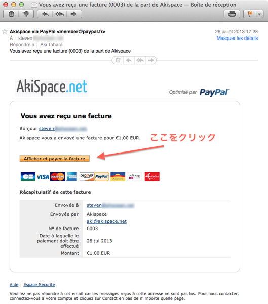
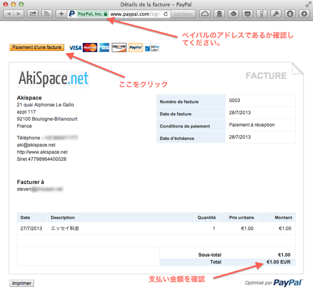
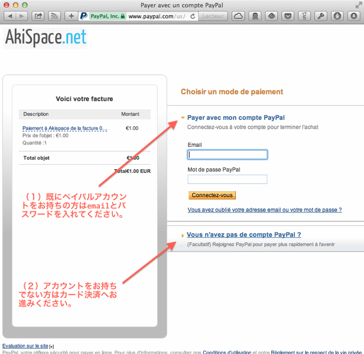
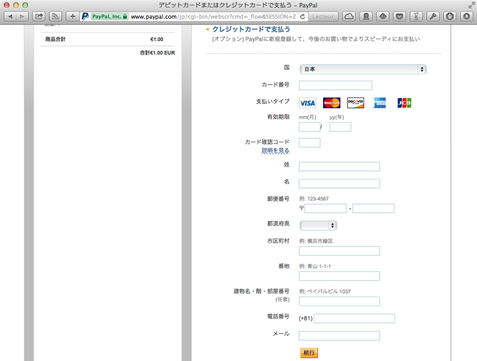
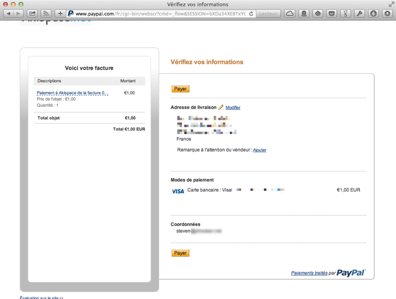
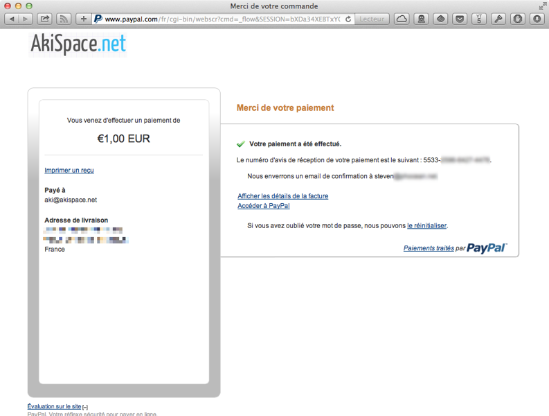

## Essay

遠方にお住みの方、普段レッスンをご提供できない方などを対象にエッセイ添削をメールにてご提供致します。

随時受け付けておりますのでご連絡ください（但し時間の関係上人数を制限させていただくことがあります）。字数制限は３００字前後。特に回数や期間などは設定致しませんので、休暇を利用した添削、あるいは定期的な添削などご希望をお伝えください。

TOEFLではライティングセクションで高得点（２５点以上）、英検準１級ではE-mailライティングで満点（１４点）を獲得してくる生徒さんもいます（２０１６年度より新しいライティング形式に対応）。また帰国子女入試（英語小論文）においても中学、高校、大学とたくさんいい結果を報告して頂いています。

### エッセイ添削の流れ：
１課題に３回分の添削が含まれます。

<table>
<tr><td>Step1 </td><td>課題をメールにてお送りしますので、まずは自分なりにエッセイを仕上げてください。 </td></tr>
<tr><td>Step2</td><td>段落のまとめ方、テーマに対する意見内容、サポート文、間違った箇所の文法説明、自然な文章に近づくための表現指導など、細かくチェック致します。訂正された部分を書き改め再度エッセイをまとめ上げてください。全て日本語での説明になります。</td></tr>
<tr><td>Step3</td><td>１回目の添削同様、間違いをできるだけ減らし、自然な表現に仕上がるよう指導いたします。エッセイのテーマによっては２回目の添削で仕上がる場合もありますが、その場合は関連した課題を出します。訂正された部分を最終調整し、エッセイを完成させてください。 </td></tr> 
<tr><td>Step4</td><td>完成したエッセイ全体を見て、コメントを添えたいと思います。また参考になるよう違った角度から見た意見なども英語で加えます。</td></tr>
</table>

### 添削料金の目安：

<table>
<tr><td>レベル１/〜英検２級(80〜100words)</td><td>25€ </td></tr>
<tr><td>レベル２/準１級 (120-150words)/中学入試(英語小論文/内容と字数によります。)</td><td>30€(100words)-40€(200words) </td></tr>
<tr><td>レベル３/英検１級(200-240words)/TOEFL(300words)/IELTS(250words以上)/高校大学入試(英語小論文/内容と字数によります。)</td><td>40€(200words)-50€(300words)</td></tr>
<tr><td>レベル４/SAT(300-400words)/その他字数が300字を超える場合</td><td>50€ 〜</td></tr> 
</table>

入試対策では学校によりレベルが変わりますのでご相談ください。

支払い方法はご相談に応じます。Paypalの場合ユーロ建てでお願い致します。

### Paypal

エッセイ添削が終了致しましたらこちらからお支払いのメールをお送り致します。

メールを開き画面上のAfficher et payer la factureをクリックして下さい。

セキュリティのためまずは画面の上方にあるアドレスがPayPalであるかご確認下さい。
画面右下にある請求金額をお確かめの上、Paiement d'une factureをクリックして下さい。

支払い方法は二通りあります。
（１）ペイパルアカウントをお持ちの方はe-mailとパスワードを挿入、（２）ペイパルアカウントをお持ちでない方はVous n'avez pas de compte PayPalをクリックしてカード決済のページにお進みください。

カード決済のページに移り日本語を選びますと日本語表示に切り替わります。
必要事項を記入して頂き、完了しましたら続行ボタンをクリックして下さい。

確認のページにてpayerのボタンをクリックしますと手続きが完了します。

最後に手続き完了のページが表示されます。

